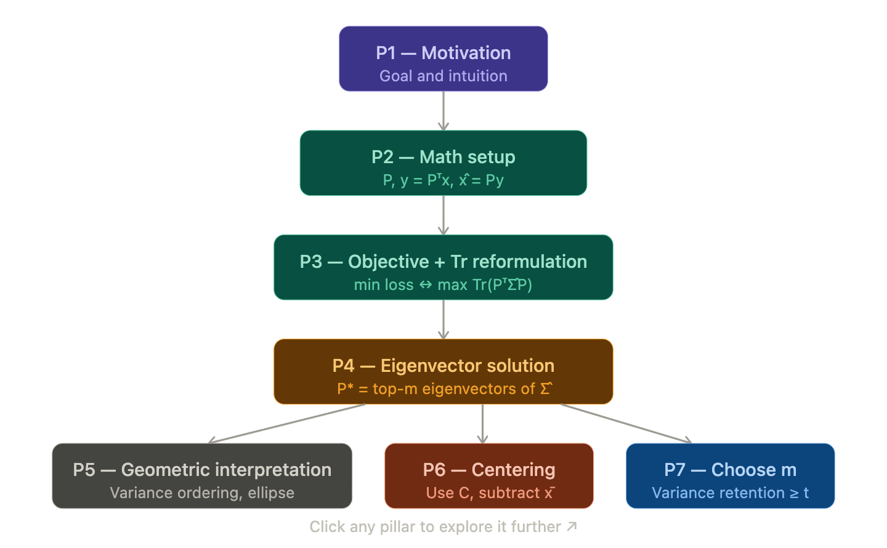
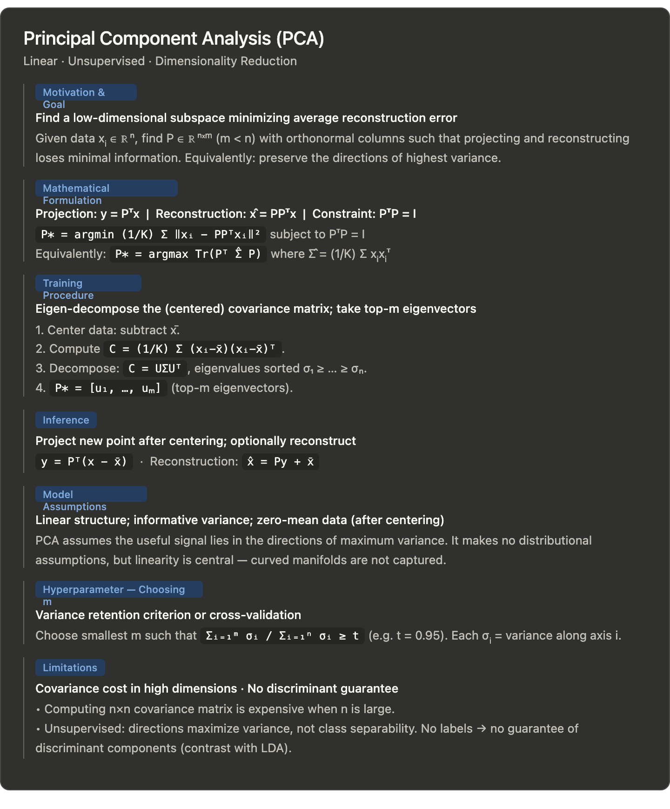

Here's the full study guide for **Principal Component Analysis (PCA)**.

---

## 1 — Main Pillars

| # | Title | Exam axis |
|---|---|---|
| P1 | Goal and motivation | Motivation and goal |
| P2 | Mathematical setup | Mathematical formulation |
| P3 | Objective function and its reformulation | Objective function / optimality criterion |
| P4 | Optimal solution: eigenvectors of the covariance matrix | Training procedure |
| P5 | Geometric interpretation and variance preservation | Model assumptions & interpretation |
| P6 | Data centering requirement | Model assumptions |
| P7 | Selecting the number of components m | Model variants / hyperparameter |
| P8 | Pros and limitations | Limitations |

---

## 2 — Deep Dive per Pillar

---

### P1 — Goal and Motivation
**Axis:** Motivation and goal

**Essential sentences**
- PCA is a *linear*, *unsupervised* dimensionality reduction technique.
- It finds a new set of *orthogonal directions* (principal components) along which to project the data in order to **minimize the average reconstruction error**.

**Logical moves**
1. We have data in ℝⁿ; we want a lower-dimensional subspace ℝᵐ (m < n).
2. Projection must be reversible (reconstruct x̂ from y).
3. Choose the subspace that loses the least information → minimize reconstruction error.

**Keywords:** linear, unsupervised, dimensionality reduction, orthogonal directions, principal components, reconstruction error.

**Easy-to-forget details**
- "Unsupervised" is load-bearing: there are *no labels*, so no guarantee the directions are discriminant.
- The technique simultaneously minimizes reconstruction error AND maximizes preserved variance — these are equivalent (not two separate criteria).

---

### P2 — Mathematical Setup
**Axis:** Mathematical formulation

**Essential formulas**
- Dataset: X = {x₁, …, xₖ}, with xᵢ ∈ ℝⁿ, **zero-mean** (for now).
- Projection matrix: P ∈ ℝⁿˣᵐ, columns orthonormal → **PᵀP = I**.
- Projected coordinates: **y = Pᵀx** (low-dim representation).
- Reconstruction: **x̂ = Py** = PPᵀx.

**Logical moves**
1. A subspace of dimension m in ℝⁿ is represented by m orthonormal basis vectors stacked as columns of P.
2. Projection: go from ℝⁿ → ℝᵐ with Pᵀ.
3. Reconstruction: go back from ℝᵐ → ℝⁿ with P.

**Keywords:** orthonormal basis, projection, reconstruction, PᵀP = I.

**Easy-to-forget details**
- The constraint is **PᵀP = I**, not PPᵀ = I (that would require P to be square).
- x̂ = PPᵀx, not just Px — the double application is what makes it a projection onto the subspace.

---

### P3 — Objective Function and Its Reformulation
**Axis:** Objective function / optimality criterion

**Essential formulas**

$$P^* = \arg\min_P \frac{1}{K}\sum_{i=1}^K \|x_i - PP^\top x_i\|^2 \quad \text{s.t. } P^\top P = I$$

After algebraic manipulation (using the trace operator and linearity of Tr):

$$\Leftrightarrow \quad P^* = \arg\max_P \; \mathrm{Tr}\!\left(P^\top \underbrace{\frac{1}{K}\sum_{i=1}^K x_i x_i^\top}_{=\,\hat{\Sigma}} P\right)$$

**Logical moves**
1. Expand ‖xᵢ − PPᵀxᵢ‖² and use Tr(AᵀA) = ‖A‖²_F.
2. Exploit linearity of Tr to pull the sum inside.
3. Recognize that the matrix inside Tr is exactly the (empirical, zero-mean) covariance/second-moment matrix Σ̂.
4. The minimization of reconstruction loss becomes a **maximization of the trace** of PᵀΣ̂P.

**Keywords:** trace operator, reformulation, empirical covariance matrix, second-moment matrix, maximization.

**Easy-to-forget details**
- The sign flip: minimize loss ↔ maximize trace. Students often forget to state this equivalence explicitly.
- The trace reformulation is what allows recognizing the eigenvalue structure.

---

### P4 — Optimal Solution: Eigenvectors
**Axis:** Training procedure (parameter estimation)

**Essential formulas**

Eigen-decomposition: $\frac{1}{K}\sum_i x_i x_i^\top = U\Sigma U^\top$

where Σ = diag(σ₁ ≥ σ₂ ≥ … ≥ σₙ) and U = [u₁ … uₙ].

$$\boxed{P^* = [u_1, u_2, \ldots, u_m]}$$

i.e., the **m eigenvectors corresponding to the m largest eigenvalues**.

**Logical moves**
1. Maximizing Tr(PᵀΣ̂P) subject to PᵀP = I → classic **Rayleigh quotient / trace maximization** problem.
2. Solution: columns of P are the top-m eigenvectors of Σ̂.
3. The eigenvalues σᵢ represent the variance captured along each principal direction.

**Keywords:** eigen-decomposition, eigenvectors, eigenvalues, Rayleigh quotient, top-m, U Σ Uᵀ.

**Easy-to-forget details**
- The matrix being decomposed is the **sample second-moment matrix** (or covariance if centered). After centering, it becomes the **empirical covariance matrix** C.
- You keep the eigenvectors of C, not the eigenvectors of P (circular but common mistake in wording).
- Eigenvalues must be sorted **in descending order**.

---

### P5 — Geometric Interpretation and Variance Preservation
**Axis:** Model assumptions & interpretation

**Key ideas**
- After projection onto the eigenvectors, PCA transforms data into a new coordinate system where **the first axis has the greatest variance, second axis the second greatest, etc.**
- PCA = the linear mapping that **preserves the directions of highest variance**.
- In 2D, the empirical covariance matrix can be visualized as an **ellipse**: its axes are the principal directions, and their lengths are proportional to the standard deviations (√σᵢ).

**Logical moves**
- Eigenvalue σᵢ = variance along the i-th principal component.
- Discarding the last n−m eigenvectors = discarding directions of least variance.

**Keywords:** variance ordering, coordinate system, ellipse (2D), standard deviation, linear mapping.

**Easy-to-forget details**
- The lengths of the ellipse axes are proportional to **standard deviations** (√eigenvalue), not eigenvalues directly.
- This interpretation is only valid after centering the data.

---

### P6 — Data Centering Requirement
**Axis:** Model assumptions

**Essential sentences**
- If the dataset is **not zero-mean**, the first PCA direction will approximately connect the origin and the dataset mean → generally not informative.
- It is **essential to center the data** by subtracting the sample mean x̄ before computing PCA.
- The projection matrix P is then computed from the eigenvectors of the **empirical covariance matrix**:

$$C = \frac{1}{K}\sum_{i=1}^K (x_i - \bar{x})(x_i - \bar{x})^\top$$

**Logical moves**
1. Without centering, the "principal component" just points from origin to mean.
2. Subtract x̄ first → re-run PCA on centered data → eigenvectors of C, not of the second-moment matrix.

**Keywords:** centering, sample mean x̄, empirical covariance matrix C, zero-mean assumption.

**Easy-to-forget details**
- The formula changes: x_i x_iᵀ → (x_i − x̄)(x_i − x̄)ᵀ.
- At inference time, you must also center a new test point before projecting: y = Pᵀ(x − x̄).

---

### P7 — Selecting m (Number of Components)
**Axis:** Model variants / hyperparameter selection

**Essential formulas**

Variance retention criterion — choose smallest m such that:

$$\frac{\sum_{i=1}^m \sigma_i}{\sum_{i=1}^n \sigma_i} \geq t \quad (\text{e.g., } t = 0.95)$$

Alternatively: cross-validation.

**Logical moves**
1. Each eigenvalue σᵢ = variance along axis i.
2. Total variance = sum of all eigenvalues.
3. Fraction retained by top-m components = partial sum / total sum.
4. Pick smallest m that exceeds threshold t.

**Keywords:** variance retention, explained variance ratio, threshold t, cross-validation, hyperparameter.

**Easy-to-forget details**
- m is a **hyperparameter** (not learned from data automatically).
- The criterion is a **minimum** m, not maximum — we want the most compact representation that still captures t% variance.
- σᵢ here are eigenvalues, so the ratio directly gives the fraction of variance (no need to square them, unlike singular values).

---

### P8 — Pros and Limitations
**Axis:** Limitations

| Limitation | Detail |
|---|---|
| High-dimensional feature space | Computing the n×n covariance matrix is expensive when n is very large |
| Unsupervised → no discriminant guarantee | PCA has no access to class labels; the principal directions maximize variance, not class separation |

**Easy-to-forget details**
- The covariance matrix issue can be sidestepped with the **kernel trick** or **SVD on X directly** (dual PCA), but the text doesn't elaborate on this.
- "No discriminant directions" is the key contrast with LDA (Linear Discriminant Analysis), which explicitly maximizes class separability.

---

## 3 — Dependency Map

```
P1 (motivation)
   └──► P2 (math setup: P, y, x̂)
           └──► P3 (objective function + trace reformulation)
                   └──► P4 (eigenvector solution)
                           ├──► P5 (geometric interpretation)
                           ├──► P6 (centering → covariance matrix C)
                           └──► P7 (choosing m)
                                    └──► P8 (limitations)
```

**Study order:** P1 → P2 → P3 → P4 → P6 → P5 → P7 → P8

Master P2 before P3 (you need the projection formula to expand the loss). Master P3 before P4 (the trace form is what reveals the eigenvalue structure). P6 is a correction to P4 — do it immediately after. P5 and P7 are consequences of P4.---


## 4 — Verification Questions

**P1 – Motivation**
> What is the goal of PCA, and what criterion is used to choose the projection subspace?

**P2 – Math setup**
> Given a dataset xᵢ ∈ ℝⁿ and a projection matrix P ∈ ℝⁿˣᵐ with PᵀP = I, write the expression for (a) the low-dimensional representation y and (b) the reconstruction x̂. What constraint must P satisfy?

**P3 – Objective function**
> Write the PCA optimization problem formally. Show that minimizing the average reconstruction error is equivalent to maximizing Tr(PᵀΣ̂P). What role does the trace operator play?

**P4 – Optimal solution**
> What is the optimal P* that solves the PCA problem? Describe the eigen-decomposition involved and explain which eigenvectors are selected and why.

**P5 – Geometric interpretation**
> How can PCA be interpreted in terms of variance? What does the covariance matrix look like geometrically in 2D, and what do the axes of that geometric object correspond to?

**P6 – Centering**
> Why is data centering necessary before applying PCA? What happens if PCA is applied to non-centered data? Write the empirical covariance matrix formula.

**P7 – Choosing m**
> State the variance-retention criterion for selecting m, the number of principal components. Write the formal condition and explain the role of eigenvalues in it.

**P8 – Limitations**
> Name two limitations of PCA. Why does being unsupervised represent a structural limitation for classification tasks?

---

## 5 — Final Summary CardA few things worth emphasizing before you close the book:




**The single most dangerous confusion** is between the second-moment matrix (used when data is already zero-mean) and the empirical covariance matrix C (used after centering). Make sure you always state which one you're using and why.

**The trace reformulation** (P3→P4) is the conceptual heart of the derivation. If an exam asks you to "derive the PCA solution," that algebraic step from minimizing ‖·‖² to maximizing Tr(PᵀCP) is what the examiner is looking for — don't skip it.

**At inference time**, don't forget to center the test point before projecting. This is a classic slip under exam pressure.

Let me know when you want to move to the next model for cross-comparison — the summary card format is ready to be stacked alongside others (LDA, FA, ICA, etc.).


