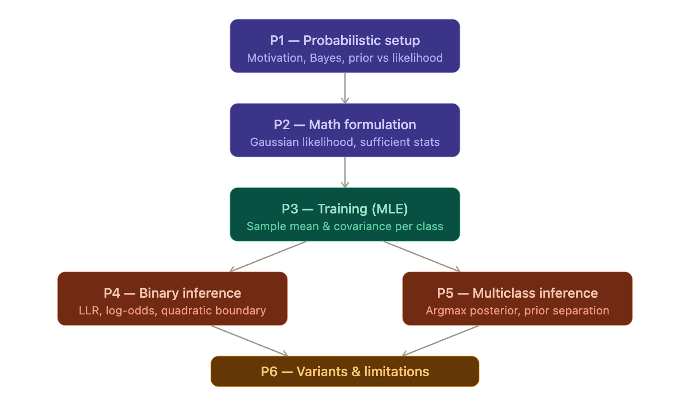
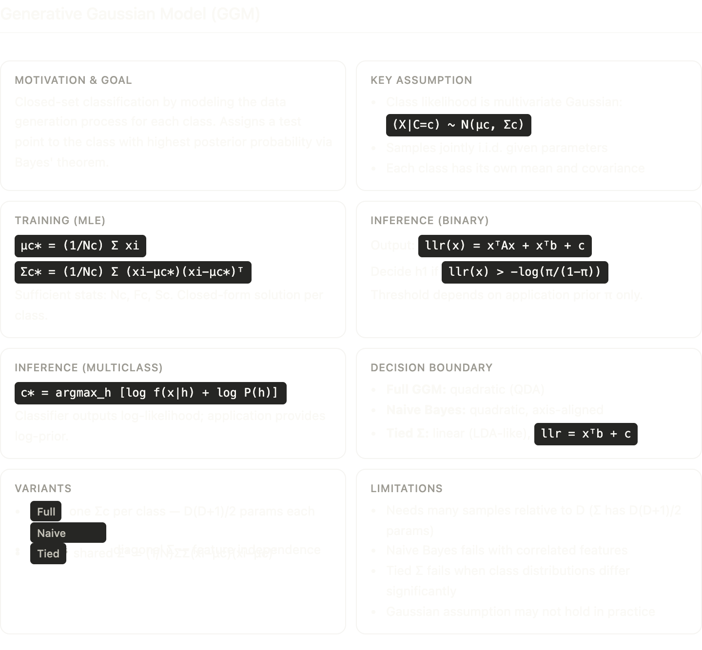

**You**

You are an expert university tutor in machine learning. I will give you a text on a single topic that I need to study for an exam where I must reproduce it in detail and with precision. Exam questions always cover these axes: - Motivation and goal of the model - Mathematical formulation (objective function / optimality criterion) - Training procedure (how parameters are estimated) - Inference procedure (how the model is used for classification) - Form of decision rules (for binary and multiclass problems) - Model assumptions - Model variants and their differences - Limitations of the approach Analyze the text and return: 1. MAIN PILLARS Break the text into logical sections mapped to the axes above. For each pillar indicate which axis it corresponds to. 2. FOR EACH PILLAR: - Short title + corresponding exam axis - Essential sentences and formulas that cannot be skipped - Logical moves to remember (e.g. "divide by the scalar X", "apply Bayes theorem", "recognize the eigenvalue form") - Technical keywords that must not be forgotten - Details that are easy to forget or commonly missed 3. DEPENDENCY MAP In what order should I study the pillars and what must I master before moving to the next one. 4. VERIFICATION QUESTIONS For each pillar, 1-2 questions formulated exactly as they would appear in the exam, to be answered with the book closed. 5. FINAL SUMMARY CARD At the end, produce a structured card with the model name, the axes covered and the key points for each one. This card will be used in the next phase for cross-model comparison, so it must be precise and consistent in format.

---

**Claude**
Here is your complete study guide for **Generative Gaussian Models**.

---

## 1. Main Pillars

**Pillar 1 — Motivation & Probabilistic Setup** → *Motivation and goal / Model assumptions*
The model addresses closed-set classification by explicitly modeling the data-generation process for each class (hence "generative"), using Bayes' theorem to compute posterior probabilities and assigning to the class with the highest one.

**Pillar 2 — Mathematical Formulation** → *Mathematical formulation / Model assumptions*
Each class likelihood is a multivariate Gaussian: $(X_t | C_t = c) \sim \mathcal{N}(\mu_c, \Sigma_c)$. The joint density factorizes as $f_{X,C}(x,c) = f_{X|C}(x|c) \cdot P_C(c)$.

**Pillar 3 — Training (ML Estimation)** → *Training procedure*
Parameters $\mu_c^*, \Sigma_c^*$ are found by maximizing the log-likelihood class by class, exploiting sufficient statistics $(N_c, F_c, S_c)$.

**Pillar 4 — Inference: Binary Case & LLR** → *Inference procedure / Form of decision rules*
Classification uses the log-likelihood ratio (LLR) compared to a threshold derived from the log-odds of the prior. The LLR is a quadratic function of $x$.

**Pillar 5 — Inference: Multiclass Case** → *Form of decision rules*
Assign $c_t^* = \arg\max_h \log f_{X|C}(x|h) + \log P(h)$.

**Pillar 6 — Variants** → *Model variants and their differences / Limitations*
Three variants: (a) full covariance (general QDA), (b) Naive Bayes Gaussian (diagonal covariance), (c) Tied covariance (LDA-like, linear decision boundary).

---

## 2. Pillar-by-Pillar Breakdown

### Pillar 1 — Motivation & Probabilistic Setup
**Exam axis:** Motivation + Model assumptions

**Essential formulas:**
$$P(C_t = c | X_t = x_t) = \frac{f_{X,C}(x_t, c)}{\sum_{c'} f_{X,C}(x_t, c')}$$
$$f_{X,C}(x,c) = f_{X|C}(x|c) \cdot P_C(c)$$

**Logical moves:**
- Apply Bayes' theorem to go from joint density to posterior
- Factorize joint into likelihood × prior (the key split)
- Distinguish *application prior* (true class probabilities) from *empirical prior* (dataset frequencies)

**Keywords:** generative model, closed-set classification, posterior probability, class likelihood, class prior, Bayes' theorem, i.i.d.

**Easy to forget:** The assumption that all samples are *jointly* i.i.d. (not just within a class). The distinction between application prior and empirical prior is a frequent exam trap.

---

### Pillar 2 — Mathematical Formulation
**Exam axis:** Mathematical formulation + Model assumptions

**Essential formulas:**
$$(X_t | C_t = c) \sim \mathcal{N}(\mu_c, \Sigma_c)$$
$$\log \mathcal{N}(x|\mu,\Sigma) = -\frac{D}{2}\log 2\pi - \frac{1}{2}\log|\Sigma| - \frac{1}{2}(x-\mu)^T\Sigma^{-1}(x-\mu)$$

The log-likelihood per class depends on data only through **sufficient statistics**:
$$Z_c = N_c, \quad F_c = \sum_{i:c_i=c} x_i, \quad S_c = \sum_{i:c_i=c} x_i x_i^T$$

**Logical moves:**
- Rewrite $\Sigma^{-1} = \Lambda$ (precision matrix) to make gradient computations cleaner
- Recognize that the log-likelihood decomposes class by class → optimize independently

**Keywords:** multivariate Gaussian, precision matrix $\Lambda$, sufficient statistics, log-likelihood decomposition

**Easy to forget:** The number of independent parameters in $\Sigma$ is $\frac{D(D+1)}{2}$ — this is what makes estimation hard in high dimensions.

---

### Pillar 3 — Training (ML Estimation)
**Exam axis:** Training procedure

**Essential formulas** (closed-form ML solutions):
$$\mu_c^* = \frac{1}{N_c} \sum_{i:c_i=c} x_i$$
$$\Sigma_c^* = \frac{1}{N_c} \sum_{i:c_i=c} (x_i - \mu_c^*)(x_i - \mu_c^*)^T$$

**Logical moves:**
- Set gradient of $\ell_c$ w.r.t. $\mu_c$ to zero → sample mean
- Set gradient w.r.t. $\Lambda_c$ to zero → sample covariance
- These two are independent: estimate $\mu^*$ first, plug in for $\Sigma^*$

**Keywords:** maximum likelihood estimation (MLE), sample mean, sample covariance, class-conditional estimation

**Easy to forget:** The normalization is by $N_c$ (class count), not $N$ (total). The ML estimate of $\Sigma$ is *biased* (divides by $N_c$, not $N_c - 1$) — this is standard for ML but can be asked.

---

### Pillar 4 — Inference: Binary Case & LLR
**Exam axis:** Inference procedure + Decision rules

**Essential formulas:**
$$\log r(x_t) = \underbrace{\log \frac{f_{X|C}(x_t|h_1)}{f_{X|C}(x_t|h_0)}}_{\text{LLR}} + \underbrace{\log \frac{\pi}{1-\pi}}_{\text{log-odds}}$$

Decision rule: $\text{llr}(x_t) \gtrless -\log\frac{\pi}{1-\pi}$

LLR is a **quadratic function** of $x$:
$$\text{llr}(x) = x^T A x + x^T b + c$$
$$A = -\frac{1}{2}(\Lambda_1 - \Lambda_0), \quad b = \Lambda_1\mu_1 - \Lambda_0\mu_0$$
$$c = -\frac{1}{2}(\mu_1^T\Lambda_1\mu_1 - \mu_0^T\Lambda_0\mu_0) + \frac{1}{2}(\log|\Lambda_1| - \log|\Lambda_0|)$$

**Logical moves:**
- The system should output the LLR; the threshold depends on the application (prior)
- Quadratic term $A$ vanishes only when $\Sigma_1 = \Sigma_0$ (tied case)

**Keywords:** log-likelihood ratio (LLR), log-odds, threshold $t$, decision surface, quadratic decision boundary, prior independence

**Easy to forget:** The constant $c$ contains a log-determinant difference term — easy to drop. The sign convention: greater LLR → favor $h_1$.

---

### Pillar 5 — Inference: Multiclass Case
**Exam axis:** Decision rules

**Essential formula:**
$$c_t^* = \arg\max_h \left[ \log f_{X|C}(x_t|h) + \log P(h) \right]$$

**Logical moves:**
- The normalizing denominator in the posterior is the same for all classes → can be dropped
- Classifier outputs $\log f_{X|C}(x|h)$; the prior term $\log P(h)$ is application-dependent

**Keywords:** argmax posterior, proportionality argument, application-dependent prior

**Easy to forget:** Explicitly separating what the classifier produces (the log-likelihood) from what the application provides (the log-prior).

---

### Pillar 6 — Variants and Limitations
**Exam axis:** Model variants + Limitations

| Variant | Covariance | Decision boundary | Pros / Cons |
|---|---|---|---|
| Full GGM | $\Sigma_c$ per class | Quadratic | Flexible; needs many samples |
| Naive Bayes Gaussian | Diagonal $\Sigma_c$ | Quadratic (axis-aligned) | Simple; fails with correlated features |
| Tied covariance | Shared $\Sigma$ | **Linear** | More stable; bad if classes differ |

**Tied covariance ML estimate:**
$$\Sigma^* = \frac{1}{N}\sum_c \sum_{i:c_i=c}(x_i - \mu_c^*)(x_i - \mu_c^*)^T$$

**Tied LLR simplifies to:**
$$\text{llr}(x) = x^T b + c, \quad b = \Lambda(\mu_1 - \mu_0)$$

**Keywords:** diagonal covariance, tied/shared covariance, linear discriminant (LDA-like), quadratic discriminant (QDA-like), feature independence assumption

**Easy to forget:** Naive Bayes Gaussian is equivalent to a full GGM with *diagonal* covariance — this equivalence does **not** hold in general for non-Gaussian Naive Bayes. Tied covariance produces a *linear* function of $x$ because the quadratic term $A = -\frac{1}{2}(\Lambda_1 - \Lambda_0) = 0$.

---

## 3. Dependency MapStudy in strict pillar order. 

P1–P2 are prerequisites for everything. P3 must be mastered before tackling inference (P4–P5). P6 makes sense only once you can read the LLR formula and identify what changes under each variant.

---

## 4. Verification Questions

**P1:**
> Define the class-conditional factorization of the joint density and explain the difference between application prior and empirical prior. When is it appropriate to substitute one for the other?

**P2:**
> Write the log-likelihood $\ell_c(\mu_c, \Sigma_c)$ for a single class and identify the three sufficient statistics it depends on. Why is the number of free parameters in $\Sigma_c$ a concern in practice?

**P3:**
> Derive the ML estimates $\mu_c^*$ and $\Sigma_c^*$ for the Generative Gaussian model. At what step does the estimate of $\mu_c^*$ become necessary for computing $\Sigma_c^*$?

**P4:**
> In the binary GGM, write the LLR as a function of $x$ and give the explicit expressions for $A$, $b$, and $c$. Explain why the decision surface is quadratic in general, and what geometric shape it takes.

**P5:**
> State the optimal multiclass decision rule and explain which term a classifier should output and which term is provided by the application.

**P6:**
> Compare the three variants of the Generative Gaussian model (full, Naive Bayes, tied) with respect to: covariance structure, number of parameters, form of the decision boundary, and failure mode.

---

## 5. Final Summary CardA few things to keep especially sharp when the exam comes:

Variants:
- Full one Σc per class — D(D+1)/2 params each
- Naive Bayes diagonal Σ — feature independence
- Tied shared Σ* = (1/N)ΣΣ(xi−μc)(xi−μc)ᵀ